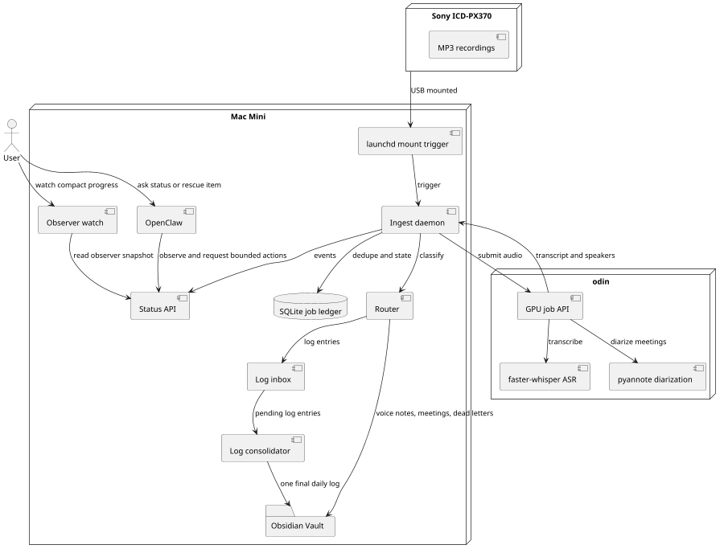

# PRD: Voice Recorder to Obsidian Logbook, Voice Notes, and Meeting Transcript System

## 1. Purpose

Build a local-first system that ingests recordings from a Sony ICD-PX370, transcribes them using GPU resources on `odin`, classifies them by spoken prefix, and stores them as structured Markdown in Obsidian.

The system must support:

- Daily logbook entries
- Category-based voice notes
- Meeting transcripts with speaker separation
- Dead-letter handling for unclassified recordings
- Automatic triggering when the recorder is connected to the Mac Mini
- Observability and controlled interaction through OpenClaw

---

## 2. Key design change

The previous design placed daily logs directly under `10 - Logs`.

The updated design is:

1. All log entries first enter a log inbox.
2. Log entries are not immediately written into the final daily log.
3. When a new log entry arrives with a date later than the current open log date, all earlier log entries are consolidated.
4. The final daily log is written once per day into the timestamp folder:

```text
06 - Timestamps/2026/04-April/2026-04-12-Sunday-Log.md
````

This means:

* `10 - Logs` becomes the operational log inbox and processing area.
* `06 - Timestamps` becomes the canonical final logbook location.
* There must be one and only one final daily log file per date.

---

## 3. Goals

## 3.1 Primary goals

* Automatically ingest recordings from the Sony ICD-PX370.
* Transcribe recordings locally through `odin`.
* Classify recordings by spoken prefix.
* Store log entries in an inbox first.
* Consolidate log entries into a single daily Obsidian Markdown log.
* Route non-log voice notes into category-specific folders.
* Process meetings with speaker diarization.
* Route unknown items into dead letters.
* Allow OpenClaw to observe system state and request bounded actions.
* Provide an independent read-only observer/watch program for current pipeline
  progress, recent completions, failures, and duration statistics.

## 3.2 Non-goals for MVP

* Real-time transcription.
* Perfect speaker identity.
* Fully automatic semantic classification without spoken prefixes.
* Automatic deletion from the Sony recorder.
* OpenClaw directly managing shell commands or file deletion.

---

## 4. Core folder model

## 4.1 Obsidian vault structure

```text
Obsidian Vault/
  06 - Timestamps/
    2026/
      04-April/
        2026-04-12-Sunday-Log.md

  10 - Logs/
    00 - Inbox/
      2026/
        04-April/
          2026-04-12/
            2026-04-12T09-14-22-log-entry.md
            2026-04-12T13-45-10-log-entry.md

    90 - Consolidated/
      2026/
        04-April/
          2026-04-12.consolidated.json

  20 - Notes/
    00 - Inbox/
      Ideas/
      Tasks/
      Research/
      Reminders/

  30 - Meetings/
    2026/
      04-April/

  99 - Dead Letters/
    2026/
      04-April/
```

## 4.2 External processing structure on Mac Mini

Original audio and processing state should live outside the Obsidian vault unless explicitly configured otherwise.

```text
~/VoiceIngest/
  inbox/
  processing/
  processed/
  failed/
  archive/
  logs/
  voice_ingest.sqlite
```

---

## 5. Main workflow



---

## 6. Recording classification rules

Classification is based on the first spoken word or phrase after transcription.

## 6.1 Normalization

Before classification, normalize the first 20 transcript words:

* Lowercase
* Remove punctuation
* Collapse whitespace
* Trim filler words if configured, for example `um`, `uh`, `okay`
* Match against configured aliases

## 6.2 Log entries

A recording is a log entry only if it starts with:

```text
log entry
logentry
```

Examples:

```text
Log entry I need to rethink the data ingestion flow.
Logentry capture this idea about OpenClaw visibility.
```

The prefix is stripped before writing final content.

## 6.3 Meetings

A recording is a meeting if it starts with:

```text
meeting
```

Examples:

```text
Meeting architecture review with Chris and Matthew.
Meeting weekly planning.
```

Meetings use transcription plus diarization.

## 6.4 Other voice categories

Other messages are categorized by the first word or phrase.

Example category config:

```yaml
categories:
  idea:
    aliases:
      - idea
      - ideas
    folder: "20 - Notes/00 - Inbox/Ideas"

  task:
    aliases:
      - task
      - todo
      - to do
    folder: "20 - Notes/00 - Inbox/Tasks"

  research:
    aliases:
      - research
      - question
    folder: "20 - Notes/00 - Inbox/Research"

  reminder:
    aliases:
      - reminder
      - remind me
    folder: "20 - Notes/00 - Inbox/Reminders"

  meeting:
    aliases:
      - meeting
    folder: "30 - Meetings"
    diarize: true
```

## 6.5 Dead letters

If no configured prefix matches, the recording is classified as a dead letter.

Dead letters are stored under:

```text
99 - Dead Letters/YYYY/MM-Month/
```

They are retained for 4 weeks.

---

## 7. Log inbox and consolidation behavior

## 7.1 Log inbox requirement

All log entries must first be written as individual inbox items.

Example inbox file:

```text
10 - Logs/00 - Inbox/2026/04-April/2026-04-12/2026-04-12T09-14-22-log-entry.md
```

Example content:

```markdown
---
type: log_entry_inbox
entry_id: 2026-04-12T09-14-22-sony-icd-px370
entry_date: 2026-04-12
entry_time: 09:14:22
source_audio: 2026-04-12T09-14-22.mp3
status: pending_consolidation
asr_model: faster-whisper-large-v3
---

Need to rethink the data ingestion flow for dead letters.
```

## 7.2 Canonical daily log path

Final consolidated daily logs must be written to:

```text
06 - Timestamps/{YYYY}/{MM}-{Month}/{YYYY}-{MM}-{DD}-{Weekday}-Log.md
```

Example:

```text
06 - Timestamps/2026/04-April/2026-04-12-Sunday-Log.md
```

## 7.3 Consolidation trigger

When a new log entry arrives, compare its `entry_date` to the current open log date.

Rules:

1. If this is the first log entry, create an open log date.
2. If the new entry has the same date as the open log date, keep it in the inbox.
3. If the new entry has a later date than the open log date, consolidate all inbox entries for dates earlier than the new entry date.
4. The new entry remains in the inbox for its own date.
5. If a late entry arrives for an already consolidated date, rebuild the existing daily log file for that date. Do not create a second daily log.

## 7.4 Consolidation output

Final log example:

```markdown
---
type: daily_log
date: 2026-04-12
source: voice_ingest
entry_count: 3
generated_from: "10 - Logs/00 - Inbox/2026/04-April/2026-04-12"
---

# Sunday, April 12, 2026 Log

## 09:14

Need to rethink the data ingestion flow for dead letters.

_Source: `2026-04-12T09-14-22.mp3`_

## 13:45

The log inbox should remain separate from the final timestamp note.

_Source: `2026-04-12T13-45-10.mp3`_

## 18:22

OpenClaw should observe but not own ingestion.

_Source: `2026-04-12T18-22-04.mp3`_
```

## 7.5 One and only one daily log

The system must guarantee:

```text
One date = one final daily log file
```

For date `2026-04-12`, the only valid final log file is:

```text
06 - Timestamps/2026/04-April/2026-04-12-Sunday-Log.md
```

The system must not create variants like:

```text
2026-04-12-Sunday-Log-1.md
2026-04-12-Log.md
2026-04-12-Sunday.md
```

## 7.6 Late entry handling

If a log entry for a previously consolidated day arrives late:

1. Store it in the inbox first.
2. Mark it as `late_arrival`.
3. Re-render the existing canonical daily log.
4. Preserve all existing entries.
5. Insert the late entry in timestamp order.
6. Update the frontmatter `entry_count`.

---

## 8. Meeting behavior

Meetings are not stored as logbook entries.

Meeting notes are written under:

```text
30 - Meetings/YYYY/MM-Month/
```

Example:

```text
30 - Meetings/2026/04-April/2026-04-12-Sunday-Architecture-Review.md
```

Each meeting note should include:

```markdown
---
type: meeting
date: 2026-04-12
source_audio: 2026-04-12T15-00-00.mp3
asr_model: faster-whisper-large-v3
diarization_model: pyannote-speaker-diarization-3.1
speaker_status: needs_mapping
---

# Architecture Review

## Participants

- SPEAKER_00: TODO
- SPEAKER_01: TODO

## Summary

TODO

## Decisions

- TODO

## Action Items

- [ ] TODO

## Transcript

### [00:00:04] SPEAKER_00

Let's start with the ingestion daemon.

### [00:00:19] SPEAKER_01

I think the log inbox should be separate from final daily notes.
```

The daily timestamp note may include a link to the meeting:

```markdown
## Meetings

- [[30 - Meetings/2026/04-April/2026-04-12-Sunday-Architecture-Review|Architecture Review]]
```

---

## 9. Dead letters

Unknown recordings are stored as dead letters.

Path:

```text
99 - Dead Letters/YYYY/MM-Month/
```

Example:

```text
99 - Dead Letters/2026/04-April/2026-04-12T20-11-09-dead-letter.md
```

Example content:

```markdown
---
type: dead_letter
created: 2026-04-12T20:11:09
delete_after: 2026-05-10
reason: no_category_prefix_detected
source_audio: 2026-04-12T20-11-09.mp3
status: pending_review
---

# Dead Letter

## Transcript

This recording did not start with a known category prefix.

## Possible actions

- Rescue as log entry
- Rescue as idea
- Rescue as task
- Rescue as research
- Delete now
```

Retention rule:

```text
Dead letters remain for 28 days, then become eligible for deletion.
```

Deletion should preferably move files to trash first, not hard delete immediately.

---

## 10. Mac Mini daemon

The Mac Mini runs the ingestion daemon.

Trigger:

```text
Sony recorder connected through USB
```

Implementation:

* Use `launchd`.
* Trigger on mount event.
* Verify that the mounted volume is the Sony recorder.
* Copy new files.
* Do not process the same file twice.
* Do not delete from the recorder automatically.

Required daemon states:

```text
discovered
copied
submitted_to_odin
transcribed
classified
inbox_written
consolidated
written_to_obsidian
dead_lettered
failed
archived
```

---

## 11. Odin GPU worker

`odin` performs compute-heavy work.

Required services:

```text
faster-whisper transcription
pyannote speaker diarization
job API
health endpoint
```

Default transcription config:

```yaml
asr:
  engine: faster-whisper
  model: large-v3
  device: cuda
  compute_type: float16
  vad_filter: true
```

Meeting diarization config:

```yaml
diarization:
  engine: pyannote
  model: pyannote/speaker-diarization-3.1
  device: cuda
```

If `odin` is offline:

* Jobs remain queued on the Mac Mini.
* No recordings are lost.
* OpenClaw can report the queue status.

---

## 12. OpenClaw integration

OpenClaw runs on the same Mac Mini and observes the system.

OpenClaw should be able to:

* Check daemon health.
* List recent jobs.
* List dead letters.
* Request reprocessing of a job.
* Rescue a dead letter into a known category.
* Show the last consolidated daily log.
* Show pending inbox log entries.

OpenClaw should not:

* Run arbitrary shell commands.
* Delete files directly.
* Modify category configuration without approval.
* Rewrite final Obsidian logs directly.

Recommended interface:

```text
GET  /health
GET  /jobs
GET  /jobs/{id}
GET  /logs/inbox
GET  /logs/open-date
GET  /logs/consolidated/latest
GET  /dead-letters
POST /jobs/{id}/reprocess
POST /dead-letters/{id}/rescue
POST /logs/{date}/rebuild
```

## 12.1 Independent observer/watch program

Logbook should also provide a compact read-only observer program for direct
operator use. The observer is not a supervisor and does not mutate pipeline
state. It consumes a consistent status snapshot from the API or reads the SQLite
ledger in read-only mode.

The observer should show:

* Current active pipeline run, command, stage, heartbeat age, elapsed time, and
  stale-run warning.
* Current active job, route kind, ledger status, safe filename or job ID, input
  size, and progress bar.
* Recent finished jobs with success/dead-letter/failure status, classification,
  finish time, and total duration.
* Recent failures and blocked states with safe, actionable detail.
* Basic 24-hour and 7-day statistics: jobs seen, succeeded, failed, dead letters,
  queue depth, p50 duration, and p90 duration.
* Cleanup, `odin`, vault-sync, and memory-graph health summaries.

Progress must be labelled by source:

```text
measured
estimated
unknown
```

Measured progress is used only when the pipeline can report real work completed,
for example copied bytes or completed files. If a stage cannot report real
progress, the observer estimates ETA from rolling stage-duration history keyed by
stage, route kind, model, and input size. If there is not enough history, it
shows elapsed time and `collecting baseline` rather than inventing precision.

Recommended interfaces:

```text
GET /observer/snapshot
logbook watch --env .env
logbook watch --env .env --once
logbook watch --env .env --json
logbook watch --api http://127.0.0.1:8788
```

The observer must not expose source audio paths, copied audio paths, transcript
paths, bearer tokens, or transcript text by default.

---

## 13. Data model

## 13.1 Recording job

```yaml
recording_job:
  id: string
  source_device: Sony ICD-PX370
  source_filename: string
  checksum_sha256: string
  discovered_at: datetime
  copied_at: datetime
  audio_date: date
  audio_time: time
  status: string
  transcript_path: string
  obsidian_path: string
```

## 13.2 Log inbox entry

```yaml
log_entry:
  entry_id: string
  recording_job_id: string
  entry_date: date
  entry_time: time
  transcript_text: string
  inbox_path: string
  canonical_log_path: string
  consolidation_status:
    - pending
    - consolidated
    - late_arrival
    - rebuilt
```

## 13.3 Daily log consolidation record

```yaml
daily_log:
  date: date
  canonical_path: string
  entry_count: integer
  first_entry_time: time
  last_entry_time: time
  generated_at: datetime
  source_inbox_folder: string
  checksum: string
```

## 13.4 Pipeline observer telemetry

Observer telemetry is separate from durable job state. SQLite remains the source
of truth for idempotency and recovery; telemetry records what the running
pipeline is doing so independent programs can watch it.

```yaml
pipeline_run:
  id: string
  command: string
  host: string
  pid: integer
  started_at: datetime
  heartbeat_at: datetime
  finished_at: datetime
  status:
    - running
    - succeeded
    - failed
    - abandoned
  exit_code: integer

pipeline_stage_event:
  run_id: string
  recording_job_id: string
  stage: string
  event:
    - queued
    - started
    - progress
    - succeeded
    - failed
    - skipped
  occurred_at: datetime
  progress_current: number
  progress_total: number
  progress_percent: number
  progress_kind:
    - measured
    - estimated
    - unknown
  input_bytes: integer
  audio_seconds: number
  safe_detail: string

pipeline_stage_duration:
  stage: string
  route_kind: string
  model: string
  input_size_bucket: string
  sample_count: integer
  duration_p50_seconds: number
  duration_p90_seconds: number
  average_seconds_per_mb: number
  updated_at: datetime
```

---

## 14. Acceptance criteria

## 14.1 Ingestion

* Connecting the Sony recorder triggers ingestion automatically.
* Previously processed recordings are not duplicated.
* Original audio is preserved.
* Failed jobs remain recoverable.

## 14.2 Log routing

* A recording starting with `log entry` enters the log inbox.
* A recording starting with `logentry` enters the log inbox.
* Log entries are not directly appended to the final daily log at ingestion time.

## 14.3 Log consolidation

* If a new log arrives with a later date, earlier pending log entries are consolidated.
* The final daily log is written to:

```text
06 - Timestamps/YYYY/MM-Month/YYYY-MM-DD-Weekday-Log.md
```

* Only one final daily log exists per date.
* Late arrivals rebuild the existing daily log instead of creating a duplicate.
* The final daily log is sorted by entry timestamp.

## 14.4 Category routing

* A recording starting with `idea` is routed to Ideas.
* A recording starting with `task` or `todo` is routed to Tasks.
* A recording starting with `research` or `question` is routed to Research.
* Unknown prefixes are routed to Dead Letters.

## 14.5 Meetings

* A recording starting with `meeting` is transcribed and diarized.
* Meeting notes contain speaker labels.
* Speaker labels can be manually mapped to real names.
* Meeting notes are stored separately from daily logs.

## 14.6 Dead letters

* Unknown recordings are stored in `99 - Dead Letters`.
* Dead letters contain transcript, source audio, reason, and delete-after date.
* Dead letters are retained for 28 days.
* Dead letters can be rescued into a known category.

## 14.7 OpenClaw

* OpenClaw can show health, queue status, inbox status, and dead letters.
* OpenClaw can request bounded reprocessing.
* OpenClaw cannot perform arbitrary deletion or uncontrolled shell execution.

## 14.8 Observer/watch program

* The observer can report a current run, current stage, heartbeat age, elapsed
  time, recent completions, failures, successes, and summary statistics.
* A running job displays a progress bar labelled as measured, estimated, or
  unknown.
* Estimated progress uses rolling historical duration data based on stage and
  input size, and includes confidence or sample count.
* Stale pipeline heartbeats are visible.
* The observer has `--once`, live refresh, and JSON output modes.
* The observer is read-only and path-safe.

---

## 15. Risks and mitigations

## 15.1 Prefix transcription errors

Risk:

Whisper may mishear `log entry`.

Mitigation:

Use alias matching and fuzzy matching only within the first 20 words.

Examples to accept:

```text
log entry
logentry
log entries
lock entry
```

Only use fuzzy matching for known safe prefixes.

## 15.2 Current-day logs remain in inbox

Risk:

The current day is not finalized until a later-dated log arrives.

Mitigation:

Expose the open log inbox to OpenClaw and optionally provide a preview note.

Optional preview path:

```text
10 - Logs/00 - Inbox/Open-Log-Preview.md
```

## 15.3 Late-arriving logs

Risk:

A late log for a closed date could create duplication.

Mitigation:

Daily logs are rendered from the log-entry ledger and rebuilt atomically.

## 15.4 Speaker identity

Risk:

Diarization separates speakers but does not reliably identify real people.

Mitigation:

Use `SPEAKER_00`, `SPEAKER_01`, then allow manual mapping.

## 15.5 OpenClaw overreach

Risk:

OpenClaw could accidentally modify or delete data if given too much access.

Mitigation:

Expose a narrow API. Do not give OpenClaw broad shell or filesystem control.

## 15.6 Misleading progress estimates

Risk:

Estimated progress can look more precise than it is, especially for `odin`
transcription and diarization where runtime depends on model, audio duration,
silence, and GPU state.

Mitigation:

Label progress as measured, estimated, or unknown. Show sample count and
confidence for ETA, cap estimated progress below completion until the stage
actually finishes, and show `collecting baseline` when history is too sparse.

---

## 16. Implementation phases

## Phase 1: Ingestion and transcription

* Detect Sony recorder.
* Copy new recordings.
* Submit audio to `odin`.
* Store transcripts.
* Maintain SQLite job ledger.

## Phase 2: Deterministic routing

* Implement prefix classifier.
* Route log entries to inbox.
* Route known categories.
* Route unknowns to dead letters.

## Phase 3: Log consolidation

* Implement open log date.
* Implement daily consolidation trigger.
* Write canonical daily log to `06 - Timestamps`.
* Guarantee one file per date.
* Implement late-arrival rebuild.

## Phase 4: Meetings

* Add pyannote diarization for meeting recordings.
* Store meeting notes.
* Link meetings into timestamp daily notes.

## Phase 5: OpenClaw observability

* Add status API.
* Add queue reporting.
* Add dead-letter rescue.
* Add log rebuild endpoint.

## Phase 6: Independent observer

* Add observer telemetry for pipeline runs, stage events, and duration history.
* Add read-only observer snapshot API.
* Add compact `logbook watch` CLI with live, once, and JSON modes.
* Add measured progress where available and historical ETA where progress is not
  directly measurable.

## Phase 7: Refinement

* Add summaries.
* Add action item extraction.
* Add speaker-name mapping.
* Add optional search and knowledge graph extraction.

---

## 17. Open questions

1. Should the current open day have a live preview note in Obsidian?
2. Should consolidated inbox entries remain forever, or be archived outside the vault?
3. Which category prefixes should be preconfigured beyond `idea`, `task`, `research`, `reminder`, and `meeting`?
4. Should late-arriving entries be inserted silently, or should OpenClaw notify you?
5. Should meeting summaries be generated automatically, or only after manual review?
6. Should source audio be linked from Obsidian, or kept completely outside the vault?

---

## 18. Recommended MVP decision

Use this rule:

```text
Logs are staged first, final daily logs are rendered later.
```

That keeps the system clean, prevents duplicate daily logs, and gives you a safe recovery path if classification, transcription, or consolidation needs correction.
